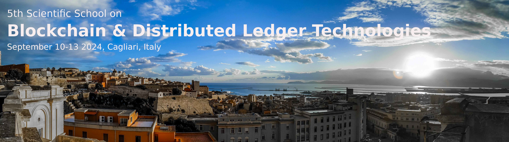

# 5th Scientific School on Blockchain & Distributed Ledger Technologies

**Cagliari (Italy), September 10-13, 2024**

Crypto economics is a new discipline born after the rise of virtual currencies and distributed ledger technologies, and is rapidly developing in a unique intersection between computing, cryptography,  law,
economics, and game theory. The school aims at disseminating  knowledge about the foundations and the applications of these technologies to researchers, PhD students, scholars and technologists in industry and academia, not excluding under- or new graduates with strong technical drive and a sufficient background.

## Important dates

- Application deadline: July 15, 2024
- Notification: July 19, 2024
- School dates: **September 10-13, 2024**

## Venue & accommodation

The school, which is planned as a physical, in-person event, will be hosted at the [Department of Mathematics and Computer Science](https://goo.gl/maps/jjzgXGtSLtVBSrDu9) of the University of Cagliari (Italy).

The venue is in the city center, close to the historical area of Castello. 
The city center can be reached from the [Cagliari airport](http://www.sogaer.it/it) in 15' by taxi (it costs around 20 EUR), or by train.

In the center of Cagliari there are several affordable accommodation opportunities: check [bed-and-breakfast.it](https://www.bed-and-breakfast.it/lista_strutture_ur.cfm?locale=it&zona=Castello&citta=Cagliari&idregione=14) and
[airbnb.it](https://www.airbnb.it/rooms/6619495?source_impression_id=p3_1688053073_kJI5XWcXBEsz1r%2B1).

## Registration & selection

The school plans for a maximum of 20 attendees; the attendance to the school is **free**, while travel and accommodation expenses are to be paid by participants (there are several affordable accommodations in Cagliari). 
The participants will be selected by the scientific  committee on a CV best-match basis.
All sessions will be held in English.

**Registration link**: [forms.gle/bBdBLTu5986NEz4j8](https://forms.gle/bBdBLTu5986NEz4j8)

## Lectures

<b>Smart Contract Languages: a Comparative Analysis</b>

Decentralized blockchain platforms support the secure exchange of assets among users without relying on trusted third parties. These exchanges are programmed with smart contracts, computer programs directly executed by blockchain nodes. 
Multiple smart contract languages are available nowadays to developers, each with its own distinctive features, strengths, and weaknesses. In this lecture, we examine the smart contract languages used in six major blockchain platforms: Ethereum, Solana, Cardano, Algorand, Aptos, and Tezos. Starting with a high-level overview of their design choices, we discuss their programming style, security, code readability, and usability.

Massimo Bartoletti, University of Cagliari (IT)

  
<b>Solidity vs. Move side-by-side</b>

  In this lecture we give a side-by-side overview of two of the main
smart contract languages: Solidity and Move.
Solidity is the most widespread language for smart contracts, used
since 2015 on Ethereum and later adopted by several other blockchain
platforms. Move was originally designed for the (now abandoned)
Libra/Diem blockchain, and it is currently used by Aptos, Sui and IOTA.
Each language has its own strengths and weaknesses. Solidity is easy
to learn and has a large ecosystem of development tools, but it is
prone to quirks that can lead to vulnerabilities. Move, on the other
hand, is designed to ensure the safe handling of assets, enforcing
their conservation and preventing duplication through its linear type
system, albeit at the cost of a more convoluted programming style.
During this lecture we will illustrate Solidity and Move through a
common set of use cases; in the meanwhile, we will discuss their
design principles, programming style and security implications.

Andrea Pinna, University of Cagliari (IT)
Alvise Spanò, Ca' Foscari University of Venice (IT)

<b>Decentralized Finance (DeFi) Protocols and their Compositions</b>

Decentralized finance (DeFi) builds on distributed ledger technologies (DLT) to offer services such as trading, lending and investing without using a traditional centralized intermediary. A range of DeFi protocols implements these services as a suite of smart contracts. In this lecture, we will explore the core components of the most relevant DeFi protocols, such as Decentralized Exchanges (DEXs) and Protocols for Loanable Funds (PLFs). Next, we will discuss how they can interoperate. The fact that DeFi smart contracts can be "composed", i.e. utilize the functionalities of other protocols to provide novel financial services, introduces enormous technological and economic complexity that makes it increasingly difficult to assess the risks and potential of DeFi financial products. 

Pietro Saggese, IMT Lucca (IT)

<b>Securing Ethereum Contracts: Techniques and Tools (with a glimpse on AI)</b>
  
Ethereum smart contracts are self-executing programs with terms encoded on the Ethereum blockchain. By enabling decentralized applications (dApps), they revolutionize industries such as finance, supply chain, and real estate. However, the immutability of the blockchain amplifies the catastrophic effects of bugs or vulnerabilities in these contracts. In this lesson, we will explore some of the most common vulnerabilities and how, in some cases, they caused the loss of millions of dollars worth of ether. We will then examine the tools available to developers to detect these vulnerabilities before deployment, comparing methods using classical techniques like static analysis and modern approaches such as machine learning and AI.

Dalila Ressi, Ca' Foscari University of Venice (IT)

<b>Preventing DeFi Bugs with Formal Verification</b>

Join us for an engaging workshop on the Certora Prover, a cutting-edge formal verification tool designed to uncover bugs in DeFi smart contracts. We will begin with a brief lecture introducing the fundamentals of formal verification, its underlying principles, and its unique advantages. The primary focus of the workshop will be a hands-on exercise, where participants will learn to write specifications in CVL, the Certora Verification Language. The participants will test smart contract code against their specification using the Certora Prover. This session is ideal for those looking to deepen their understanding of formal verification and smart contract security.

TBA, Certora 

<b>Programmable Cryptography on Ethereum: a Practical Overview</b>

Ethereum can now be programmed in innovative ways, thanks to the latest advances in cryptography. These new building blocks enable developers to incorporate advanced privacy features into their decentralized applications. However, the perceived complexity and misconceptions around cryptography and privacy can hinder its adoption. This lecture aims to demystify programmable cryptography, covering key concepts and practical applications. We will explore the next generation of cryptographic techniques, including Zero-Knowledge Proofs (ZKP), Multi-Party Computation (MPC), and Fully Homomorphic Encryption (FHE). The second half will be a deep dive into Semaphore, a privacy-focused ZKP protocol, examining its design and concepts, libraries and applications; with an hands-on session. 

Giacomo Corrias, Ethereum Foundation

<b>IOTA Smart Contracts</b>

The IOTA DLT supports the execution of Move smart contracts on the Layer 1. In particular, the IOTA smart contract platform supports the Sui Move flavour. In this flavour the concept of Object is central, that is, the ledger is composed of a series of Objects defined by Move structs and indexed by a key. This allows to have so called ‘owned objects’, that behaves similarly to UTXOs, and shared objects, that behaves similarly to shared accounts. The Object-based ledger, thus, mixes the benefits of a UTXO-based model and a Account-based model.

Mirko Zichichi, IOTA Foundation

<b>Building the Open Metaverse with NFTs and Blockchain Technology</b>

The metaverse is a loosely defined term referring to virtual worlds in which users represented by avatars interact, usually in 3D and focused on social and economic connection. The term "metaverse" is often linked to virtual reality technology, and beginning in the early 2020s, with Web3. The term has been used as a buzzword by companies to exaggerate the development progress of various related technologies and projects for public relations purposes. Besides marketing purposes, there are real cases
of the development of platforms that are actually used by hundreds of thousands of users, like The Sandbox. In this lecture, we will take an in-depth look at The Sandbox's platform by showing all the blockchain-based integrations that make it decentralised,
starting with the proprietary token, the use of DeFi to incentivise holders, moving on to NFTs, the transition from L1 to L2, and ending with the DAO.

Luca Clementi, The Sandbox

## CTF, Hackathon & Awards

Besides the lectures and lab sessions, the school will feature a CTF competition and an hackathon on IOTA smart contracts. Participants will be grouped by the school organizers according to their background and expertise. The groups, composed of 3 students each, will start their projects during the last two days of the school. Projects can be completed offline after the school ends.

Projects will be evaluated by the school organizers and the IOTA Foundation. 
The best three projects will receive an award in IOTA cryptocurrency.
The amounts of the awards are the following:
- **1st prize** (2500 EUR)
- **2nd prize** (1500 EUR)
- **3rd prize** (1000 EUR)

## Programme

Go to the [programme page](programme.md).

## Scientific Committee

- [Massimo Bartoletti](https://blockchain.unica.it), University of Cagliari, Italy (chair)
- Stefano Ferretti, University of Bologna, Italy
- Claudio Schifanella, Università di Torino, Italy
- Francesco Tiezzi, Università degli Studi di Firenze, Italy
- [Roberto Tonelli](https://www.unica.it/unica/it/ateneo_s07_ss01.page?contentId=SHD31003), University of Cagliari, Italy

## Organizing Committee

- Andrea Pinna, University of Cagliari, Italy
- Maria Ilaria Lunesu, University of Cagliari, Italy

## Past editions

- [2023](2023/)
- [2022](2022/)
- [2019](2019/)
- [2018](2018/)

## Acknowledgements

The school is organised thanks to the economic and organising support of the University of Cagliari, of the [SERICS project](https://serics.eu/), and of the IOTA Foundation.
